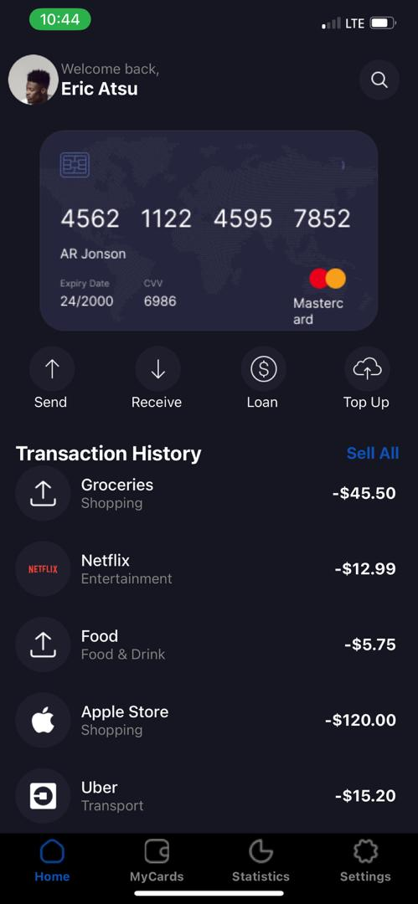
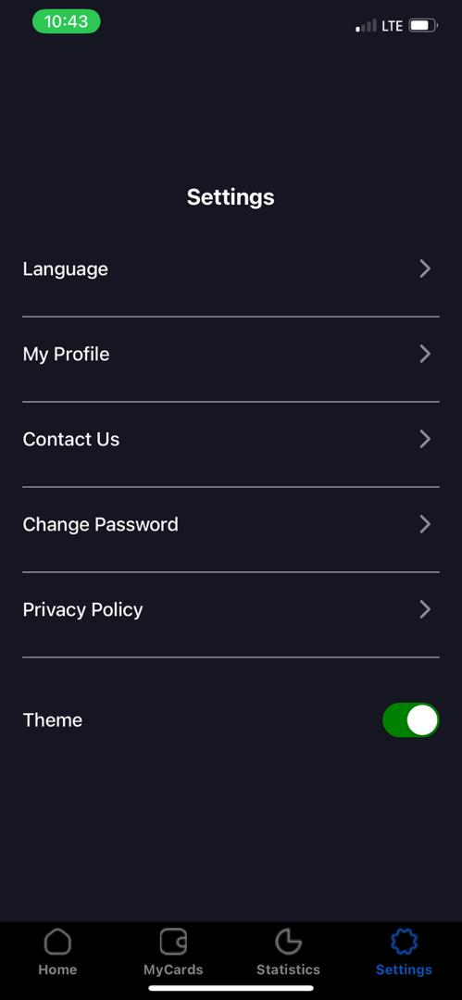
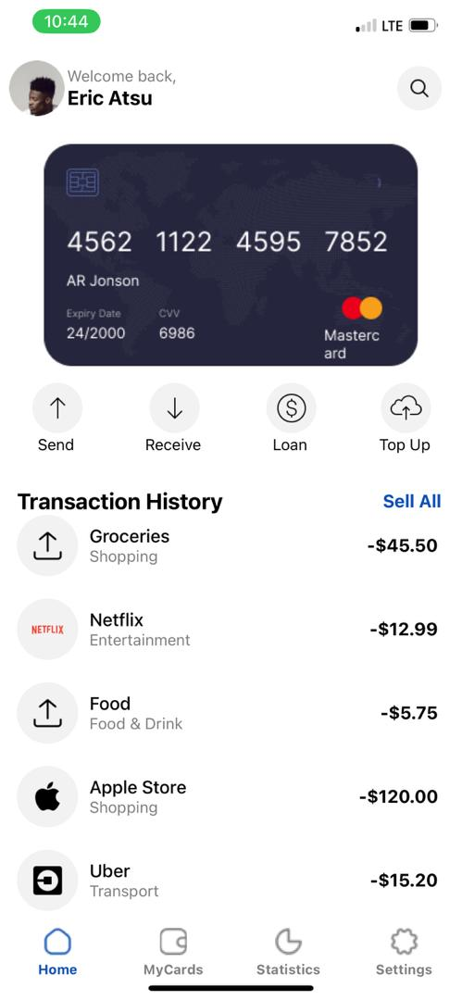
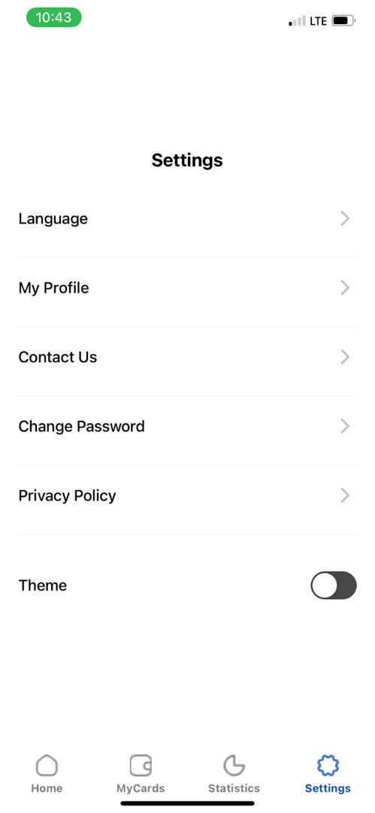

# rn-assignment5-11333031
=======
This is a new [**React Native**](https://reactnative.dev) project, bootstrapped using [`@react-native-community/cli`](https://github.com/react-native-community/cli).
=======
# React Native Assignment 5 - Mobile Application Development
>>>>>>> f2005f4 (done)

This repository hosts the implementation for Assignment 5 of the DCIT202 Mobile Application Development course. The app includes bottom tab navigation with screens for Home, MyCards, Statistics, and Settings, along with a feature to switch between light and dark themes.

## Table of Contents
- [Description](#description)
- [Screenshots](#screenshots)
- [Setup and Installation](#setup-and-installation)
- [Usage](#usage)
- [Commit History](#commit-history)

## Description
This React Native application incorporates the following features:
- Bottom tab navigation with four main screens: Home, MyCards, Statistics, and Settings.
- A context-based light and dark theme switcher.
- Custom components and styling to closely follow the provided UI design.

### Features
1. **Bottom Tab Navigation**: Utilizes `@react-navigation/bottom-tabs` to implement tab navigation.
2. **Theme Switching**: Users can toggle between light and dark themes using a context-based approach.
3. **Custom Components and Styling**: Each screen is styled to match the provided UI mockup, featuring custom components throughout the application.

## Screenshots


## Setup and Installation
To set up and run this project locally, follow these steps:

1. Clone the repository:
    ```bash
    git clone https://github.com/yourusername/rn-assignment5-ID.git
    cd rn-assignment5-ID
    ```

2. Install the dependencies:
    ```bash
    npm install
    ```

3. Start the application:
    ```bash
    npm start
    ```

## Usage
- **Navigation**: Use the bottom tab navigator to switch between the Home, MyCards, Statistics, and Settings screens.
- **Theme Switching**: Go to the Settings screen and use the toggle switch to change between light and dark themes.

### Screens Description:
1. **Home Screen**: Displays a welcome message styled according to the current theme.
2. **MyCards Screen**: Shows placeholder text, styled based on the current theme.
3. **Statistics Screen**: Shows placeholder text, styled based on the current theme.
4. **Settings Screen**: Allows users to switch between light and dark themes and contains other placeholder settings.

## Commit History
- **Initial Commit**: Set up the project structure and installed necessary dependencies.
- **Bottom Tab Navigation**: Implemented bottom tab navigation with Home, MyCards, Statistics, and Settings screens.
- **Theme Context Setup**: Added ThemeContext and ThemeProvider for theme management.
- **Screen Styling**: Styled all screens to match the provided UI mockup.
- **Theme Switching Feature**: Enabled theme switching functionality on the Settings screen.

<<<<<<< HEAD
### For iOS

```bash
# using npm
npm run ios

# OR using Yarn
yarn ios
```

If everything is set up _correctly_, you should see your new app running in your _Android Emulator_ or _iOS Simulator_ shortly provided you have set up your emulator/simulator correctly.

This is one way to run your app — you can also run it directly from within Android Studio and Xcode respectively.

## Step 3: Modifying your App

Now that you have successfully run the app, let's modify it.

1. Open `App.tsx` in your text editor of choice and edit some lines.
2. For **Android**: Press the <kbd>R</kbd> key twice or select **"Reload"** from the **Developer Menu** (<kbd>Ctrl</kbd> + <kbd>M</kbd> (on Window and Linux) or <kbd>Cmd ⌘</kbd> + <kbd>M</kbd> (on macOS)) to see your changes!

   For **iOS**: Hit <kbd>Cmd ⌘</kbd> + <kbd>R</kbd> in your iOS Simulator to reload the app and see your changes!

## Congratulations! :tada:

You've successfully run and modified your React Native App. :partying_face:

### Now what?

- If you want to add this new React Native code to an existing application, check out the [Integration guide](https://reactnative.dev/docs/integration-with-existing-apps).
- If you're curious to learn more about React Native, check out the [Introduction to React Native](https://reactnative.dev/docs/getting-started).

# Troubleshooting

If you can't get this to work, see the [Troubleshooting](https://reactnative.dev/docs/troubleshooting) page.

# Learn More

To learn more about React Native, take a look at the following resources:

- [React Native Website](https://reactnative.dev) - learn more about React Native.
- [Getting Started](https://reactnative.dev/docs/environment-setup) - an **overview** of React Native and how setup your environment.
- [Learn the Basics](https://reactnative.dev/docs/getting-started) - a **guided tour** of the React Native **basics**.
- [Blog](https://reactnative.dev/blog) - read the latest official React Native **Blog** posts.
- [`@facebook/react-native`](https://github.com/facebook/react-native) - the Open Source; GitHub **repository** for React Native.
>>>>>>> 811180c (Initial commit)
=======
## Conclusion
This app showcases the creation of a mobile application with bottom tab navigation and theme switching capabilities. It utilizes React Native's context API to manage themes, providing a consistent user experience across different screens.
>>>>>>> f2005f4 (done)



